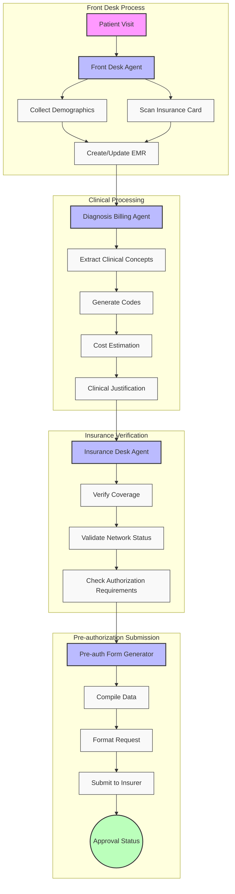

# Medical Pre-authorization Workflow

## Diagram Components

### 1. Front Desk Process
- Initial patient contact
- Demographics collection
- Insurance verification
- EMR creation/update

### 2. Clinical Processing
- Clinical data extraction
- Medical coding (ICD-10, CPT, DRG)
- Cost estimation
- Treatment justification

### 3. Insurance Verification
- Coverage validation
- Network status check
- Authorization requirements

### 4. Pre-authorization Submission
- Data compilation
- Request formatting
- Submission to insurer
- Status tracking

## Color Legend
- 🟣 Purple Boxes: AI Agents
- ⬜ White Boxes: Process Steps
- 🟢 Green Circle: Final Status

This diagram illustrates the automated workflow using CrewAI agents for medical pre-authorization processing, from patient registration to final submission.
